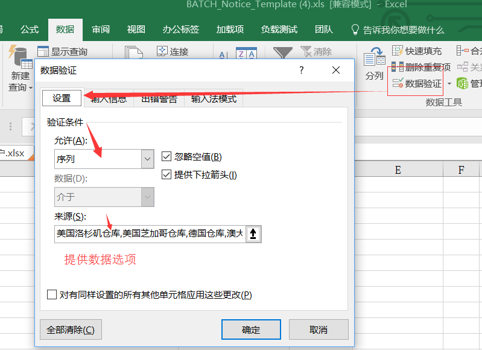

# excel2016 操作指南参考链接[excel2016操作指南](https://support.office.com/zh-cn/excel)


* > 文本搜索和替换

```txt
**文本搜索**

    搜索(注意特殊符号的处理： 可以在搜索条件中使用通配符，如星号 (*) 或问号 (?)，
    用的方法和正则表达式一样的。

    如果要直接搜索特殊符号的话：您可以查找工作表数据中的星号、问号和波形符 (~)，
    方法是在“查找内容”框中在这些符号前面加上波形符。
    例如，若要查找包含“?”的数据，可以键入 ~? 作为搜索条件。)

**文本替换**
    操作方式和搜索一样，这里就不在赘述了。
```

* > 自动调整行高和列宽

```txt
    开始-->格式-->下的选择项进行操作
```

* > 创建或删除自定义数字格式,参考链接[创建自定义格式](https://support.office.com/zh-cn/article/%E5%88%9B%E5%BB%BA%E6%88%96%E5%88%A0%E9%99%A4%E8%87%AA%E5%AE%9A%E4%B9%89%E6%95%B0%E5%AD%97%E6%A0%BC%E5%BC%8F-78f2a361-936b-4c03-8772-09fab54be7f4)

* > 公式运算

```txt
    **使用数字进行：+,-,*,/,^平方的操作**
    **使用单元格进行公式的运算：+,-,*,/,^平方的操作
```

* > 创建单元格引用

* [excel创建结构化引用](https://support.office.com/zh-cn/article/%E5%AF%B9-Excel-%E8%A1%A8%E6%A0%BC%E4%BD%BF%E7%94%A8%E7%BB%93%E6%9E%84%E5%8C%96%E5%BC%95%E7%94%A8-f5ed2452-2337-4f71-bed3-c8ae6d2b276e?ui=zh-CN&rs=zh-CN&ad=CN)

```txt
    **使用数字进行：+,-,*,/,^平方的操作**
    **使用单元格进行公式的运算：+,-,*,/,^平方的操作
    **sheet!a2--sheet表中的a2单元格**
    **可以通过名称引用进行单元格引用操作：公式->名称管理--》
    使用的话SUm(名称名字就可以了)**
    **excel数据表操作，实现结构化引用，好处在于任何添加列的操作不会影响整体的数据函数运算的结果，
    若果使用其他的单元格引用的话，插入列的操作就会影响公式的计算结果**
```

* > 创建下拉列表




```txt
 1.设置 下拉选择框， 可以不限制字符长度，并且可以跨sheet进行数据筛选（这个可以应用于16的版本低版本好像不行）
你在EXCEL同一个Sheet表里面找一个空列，在这列里面写好你的下来菜单的选项，
例如 在N列的N1到N100写好你的选项，然后选中你需要设置下来菜单的单元格，数据-数据有效性-允许-序列，来源为=$N$1:$N$100
就可以了，然后N列你要是不想让人看见可以隐藏起来（选中列，点右键隐藏）
2.使用与03-16的版本操作
假设：Sheet1表的A1:A10为自定义的序列。Sheet2表的A1:A10为要显示自定义序列的单元格。
2.1选中Sheet1表的A1:A10区域，点击【公式】菜单下的【名称管理器】，弹出窗口中点击【新建】按钮，新弹出窗口中输入一个名称（比如：XL），然后点击【确定】按钮退出。
2.2选中Sheet2表的A1:A10区域，点击【数据】菜单下的【数据有效性】选“数据有效性”，弹出窗口中【允许】处选择“序列”，来源处输入=你刚建立的名称（比如：=XL），然后设置其他诸如“出错警告”之类的信息，最后点击【确定】按钮退出。
```

